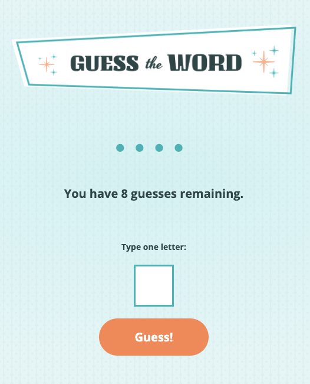

## Guess the Word Game

### The challenge:

Building a word game with HTML, CSS and JavaScript plus using an API call to a text file to pull random words for the players to guess.

### How does the app work?

A word is pulled with an API call to a Skillcrush text file that contains 800 of the most common words.

Players start by entering a letter. If they guess correctly, the letter appears in the word. If they guess incorrectly, they learn how many guesses they have remaining. The player can also see which letters they’ve already guessed. The game lets the player know if they’ve already guessed a letter or entered a non-alphabetic character.

For now, the game is set up so that the players have 8 guesses to solve the game.

### JS code challenges
